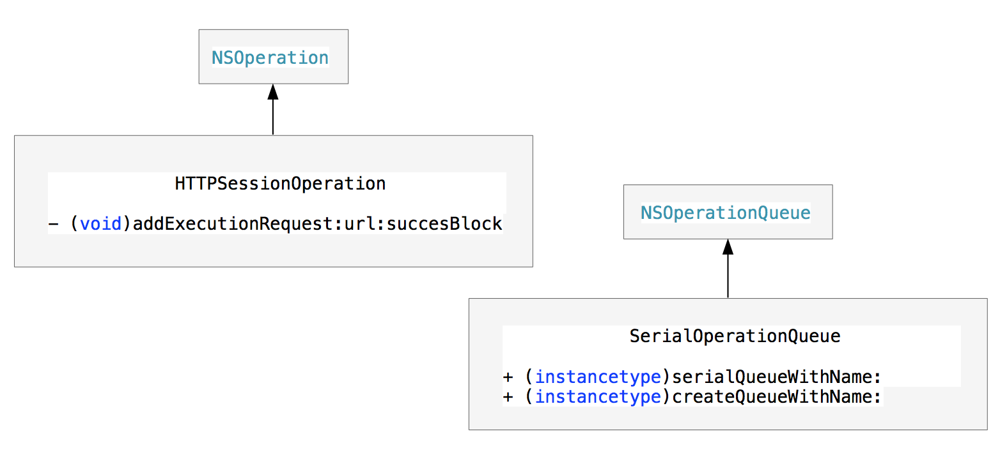

##串行网络请求模型

### 1，简介
只有两个类，
HTTPSessionOperation，用于处理网络请求逻辑，
SerialOperationQueue，NSOperation请求队列,串行的
其继承关系如下



### 2，使用方法

```
SerialOperationQueue *queue _queue = [SerialOperationQueue createQueueWithName:@"aaaaaa"];

[_queue addOperation:self.operation1];//SerialOperationQueue 添加的operation 是串行执行的
[_queue addOperation:self.operation2];


- (NSOperation*)operation2
{
    NSString *url2 = @"http://mobile.weather.com.cn/data/sk/101010100.html?_=1381891661455";
    
    HTTPSessionOperation *operation2 = [HTTPSessionOperation new];
    [operation2 addExecutionGetRequestWithManager:_manager URLString:url2 parameters:nil success:^(NSURLSessionDataTask * _Nonnull task, id  _Nonnull responseObject) {
        NSLog(@"operation2 success 1");
    } failure:nil];
    return operation2;
}

- (NSOperation*)operation1
{
... 
}

```

### 3，类实现思路

* SerialOperationQueue

	（1）维护一个全局 NSMapTable 弱引用类型的map，构造方法创建一个实例时添加到该map中，get方法将通过key找到对应的实例。
	（2）复写父类的setMaxConcurrentOperationCount，并设置为1，保证这是一个串行队列。
	（3）其它功能参照其父类NSOperationQueue
	
	
* HTTPSessionOperation

	（1）构建一个 requestArray 成员变量数组，每通过接口addExecutionRequest时，将对应的请求task添加到该数组中，
	（2）每个task请求完成时，在block回调中，通过数组获取到下一个task继续执行。所有add多个task时，也是串行执行的。
	（3）其它功能参照其父类NSOperation
	
	
 

